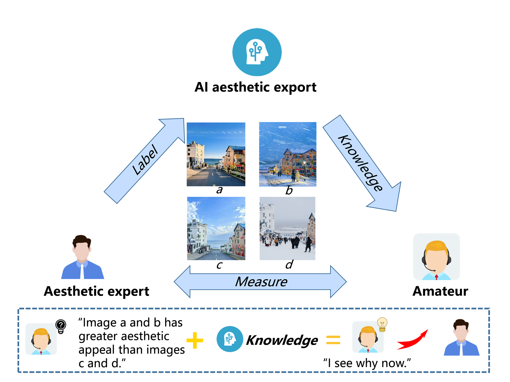

# IAAS: An Application Unlocking Image Aesthetic Evaluation Expertise

## Authors
  <p align="center">
    <a><strong>Jian Sun</strong></a>
    ·
    <a><strong>Xuan Zhang</strong></a>
    ·
    <a><strong>Peng Zhou</strong></a>
    ·
    <a><strong>Huan Liu</strong></a>
    ·
    <a href = "https://github.com/LunZhang-BTBU"><strong>Lun Zhang</strong></a>
  </p>

## Contact
If you have any questions, please contact Lun-Zhang@foxmail.com
This is the github repo for the paper ["An Application Unlocking Image Aesthetic Evaluation Expertise"].
The core of this study is the design of an Image Aesthetic Assessment System (IAAS), which integrates classic works of Explainable Artificial Intelligence (XAI), including Grad-Cam and Kolmogorov–Arnold Networks (KAN), to achieve interpretability from image pixels to aesthetic attributes and values. Based on this interpretable capability, multi-modal large language models (MLLMs) are utilized to provide analysis, interpretation, and recommendations, leveraging their exceptional linguistic abilities derived from general knowledge. This system aids professionals in enhancing their aesthetic judgment and creativity. The study reports progress on the system's ability to assist non-professional photographers in understanding image aesthetics and boosting their creativity through several manual experiments.


## Installation
IAAS can be installed from GitHub. 

**Pre-requisites:**

```
Python 3.9.7 or higher
pip
```

**For developers**

```
git clone https://github.com/LunZhang-BTBU/IAAS.git
cd IAAS
pip install -e .
```

Requirements

```python
# python==3.9.7
matplotlib==3.6.2
numpy==1.24.4
scikit_learn==1.1.3
setuptools==65.5.0
sympy==1.11.1
torch==2.2.2
tqdm==4.66.2
omegaconf==2.2.2
gdown==4.6.0
PIL==10.0.0
```

After activating the virtual environment, you can install specific package requirements as follows:
```python
pip install -r requirements.txt
```   

**Quickstart**

you can input your OpenAI api_key in [openai_api_key.txt]( ./APP/openai_api_key.txt) notebook.
Get started with [App_start.ipynb](./App_start.ipynb) notebook.

## Acknowledgement
This code is developed based on [pykan](https://github.com/KindXiaoming/pykan). Part of the code is borrowed from [pytorch-grad-cam](https://github.com/jacobgil/pytorch-grad-cam) and [deepImageAestheticsAnalysis](https://github.com/aimerykong/deepImageAestheticsAnalysis).

(cheers to the community as well)
## Demo


